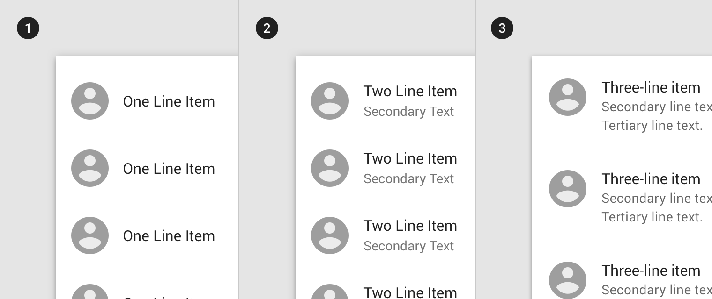

<!--docs:
title: "Lists"
layout: detail
section: components
excerpt: "Lists are continuous, vertical indexes of text or images."
iconId: list
path: /catalog/lists/
-->

# Lists

[Lists](https://material.io/components/lists/) are continuous, vertical indexes of text or images.

There are three list types:
1. [Single-line list](#single-line-list)
1. [Two-line list](#two-line-list)
1. [Three-line list](#three-line-list)



## Using lists

### Installation

```
npm install @material/list
```

### Styles

```scss
@use "@material/list";

@include list.core-styles;
```

### JavaScript

MDC List includes an optional JavaScript component which can be used for keyboard interaction and accessibility.

```js
import {MDCList} from '@material/list';

const list = new MDCList(document.querySelector('.mdc-list'));
```

> See [Importing the JS component](../../docs/importing-js.md) for more information on how to import JavaScript.

Note that the JS component does _not_ automatically instantiate ripples on list items. If you wish to include the
fully-upgraded ripple effect on list items, you must instantiate `MDCRipple` on each item:

```js
import {MDCRipple} from '@material/ripple';

const listItemRipples = list.listElements.map((listItemEl) => new MDCRipple(listItemEl));
```

### Making lists accessible

The MDCList JavaScript component implements the WAI-ARIA best practices for
[listbox](https://www.w3.org/TR/wai-aria-practices-1.1/#Listbox). This includes overriding the default tab behavior
within the list component.

The `tabindex` should be set to `0` for first list item element or selected list item element, remaining list item elements should not have `tabindex` set.

Use `role="listbox"` only for single selection list, without this role the `ul` element is implicitely `role="list"`.
Do not use `aria-orientation` attribute for standard list (i.e., `role="list"`), use component's `vertical` property to set the orientation
to vertical.

Single selection list supports `aria-selected` and `aria-current` attributes. List automatically detects the presence of these attributes
and sets it to next selected list item based on which ARIA attribute you use (i.e., `aria-selected` or `aria-current`). Please see WAI-ARIA [aria-current](https://www.w3.org/TR/wai-aria-1.1/#aria-current) article for recommended usage and available attribute values.

As the user navigates through the list, any `button` and `a` elements within the list will receive `tabindex="-1"` when
the list item is not focused. When the list item receives focus, the aforementioned elements will receive
`tabIndex="0"`. This allows for the user to tab through list item elements and then tab to the first element after the
list. The `Arrow`, `Home`, and `End` keys should be used for navigating internal list elements. If
`singleSelection=true`, the list will allow the user to use the `Space` or `Enter` keys to select or deselect a list
item. The MDCList will perform the following actions for each key press. Since list interaction will toggle a radio
button or checkbox within the list item, the list will not toggle `tabindex` for those elements.

Disabled list item will be included in the keyboard navigation. Please see [Focusability of disabled controls](https://www.w3.org/TR/wai-aria-practices-1.1/#kbd_disabled_controls) section in ARIA practices article.

Key | Action
--- | ---
`ArrowUp` | When the list is in a vertical orientation (default), it will cause the previous list item to receive focus.
`ArrowDown` | When the list is in a vertical orientation (default), it will cause the next list item to receive focus.
`ArrowLeft` | When the list is in a horizontal orientation, it will cause the previous list item to receive focus.
`ArrowRight` | When the list is in a horizontal orientation, it will cause the next list item to receive focus.
`Home` | Will cause the first list item in the list to receive focus.
`End` | Will cause the last list item in the list to receive focus.
`Space` | Will cause the currently focused list item to become selected/deselected if `singleSelection=true`.
`Enter` | Will cause the currently focused list item to become selected/deselected if `singleSelection=true`.

## Single-line list

Single-line list items contain a maximum of one line of text.

### Single-line list example

```html
<ul class="mdc-list">
  <li class="mdc-list-item" tabindex="0">
    <span class="mdc-list-item__ripple"></span>
    <span class="mdc-list-item__text">Single-line item</span>
  </li>
  <li class="mdc-list-item">
    <span class="mdc-list-item__ripple"></span>
    <span class="mdc-list-item__text">Single-line item</span>
  </li>
  <li class="mdc-list-item">
    <span class="mdc-list-item__ripple"></span>
    <span class="mdc-list-item__text">Single-line item</span>
  </li>
</ul>
```

## Two-line list

Two-line list items contain a maximum of two lines of text.

### Two-line list example

Use the `mdc-list--two-line` combined with some extra markup around the
text to style a two-line list.

```html
<ul class="mdc-list mdc-list--two-line">
  <li class="mdc-list-item" tabindex="0">
    <span class="mdc-list-item__ripple"></span>
    <span class="mdc-list-item__text">
      <span class="mdc-list-item__primary-text">Two-line item</span>
      <span class="mdc-list-item__secondary-text">Secondary text</span>
    </span>
  </li>
  <li class="mdc-list-item">
    <span class="mdc-list-item__ripple"></span>
    <span class="mdc-list-item__text">
      <span class="mdc-list-item__primary-text">Two-line item</span>
      <span class="mdc-list-item__secondary-text">Secondary text</span>
    </span>
  </li>
  <li class="mdc-list-item">
    <span class="mdc-list-item__ripple"></span>
    <span class="mdc-list-item__text">
      <span class="mdc-list-item__primary-text">Two-line item</span>
      <span class="mdc-list-item__secondary-text">Secondary text</span>
    </span>
  </li>
</ul>
```

**Note: Make sure there are no white-space characters before primary and secondary text content.**

### Three-line list

Three-line list items contains a maximum of three lines of text.

MDC Web does not currently support three-line lists.

## Other Variants

### List Groups

Multiple related lists can be grouped together using the `mdc-list-group` class on a containing element.

```html
<div class="mdc-list-group">
  <h3 class="mdc-list-group__subheader">List 1</h3>
  <ul class="mdc-list">
    <li class="mdc-list-item" tabindex="0">
      <span class="mdc-list-item__ripple"></span>
      <span class="mdc-list-item__text">line item</span>
    </li>
    <li class="mdc-list-item">
      <span class="mdc-list-item__ripple"></span>
      <span class="mdc-list-item__text">line item</span>
    </li>
    <li class="mdc-list-item">
      <span class="mdc-list-item__ripple"></span>
      <span class="mdc-list-item__text">line item</span>
    </li>
  </ul>
  <h3 class="mdc-list-group__subheader">List 2</h3>
  <ul class="mdc-list">
    <li class="mdc-list-item">
      <span class="mdc-list-item__ripple"></span>
      <span class="mdc-list-item__text">line item</span>
    </li>
    <li class="mdc-list-item">
      <span class="mdc-list-item__ripple"></span>
      <span class="mdc-list-item__text">line item</span>
    </li>
    <li class="mdc-list-item">
      <span class="mdc-list-item__ripple"></span>
      <span class="mdc-list-item__text">line item</span>
    </li>
  </ul>
</div>
```

### List Dividers

MDC List contains an `mdc-list-divider` class which can be used as full-width or inset subdivisions either within lists themselves, or standalone between related groups of content.

```html
<ul class="mdc-list">
  <li class="mdc-list-item" tabindex="0">
    <span class="mdc-list-item__ripple"></span>
    <span class="mdc-list-item__text">Item 1 - Division 1</span>
  </li>
  <li class="mdc-list-item">
    <span class="mdc-list-item__ripple"></span>
    <span class="mdc-list-item__text">Item 2 - Division 1</span>
  </li>
  <li role="separator" class="mdc-list-divider"></li>
  <li class="mdc-list-item">
    <span class="mdc-list-item__ripple"></span>
    <span class="mdc-list-item__text">Item 1 - Division 2</span>
  </li>
  <li class="mdc-list-item">
    <span class="mdc-list-item__ripple"></span>
    <span class="mdc-list-item__text">Item 2 - Division 2</span>
  </li>
</ul>
```

**Note: The role="separator" attribute on the list divider. It is important to include this so that assistive technology can be made aware that this is a presentational element and is not meant to be included as an item in a list. Note that separator is indeed a valid role for li elements.**

OR

```html
<ul class="mdc-list">
  <li class="mdc-list-item" tabindex="0">
    <span class="mdc-list-item__text">Item 1 - List 1</span>
  </li>
  <li class="mdc-list-item">
    <span class="mdc-list-item__text">Item 2 - List 1</span>
  </li>
</ul>
<hr class="mdc-list-divider">
<ul class="mdc-list">
  <li class="mdc-list-item">
    <span class="mdc-list-item__text">Item 1 - List 2</span>
  </li>
  <li class="mdc-list-item">
    <span class="mdc-list-item__text">Item 2 - List 2</span>
  </li>
</ul>
```

### Single Selection List

MDC List can handle selecting/deselecting list elements based on click or keyboard actions. When enabled, the `space` and `enter` keys (or `click` event) will trigger a
single list item to become selected and any other previously selected element to become deselected.

```html
<ul id="my-list" class="mdc-list" role="listbox">
  <li class="mdc-list-item" role="option" tabindex="0">
    <span class="mdc-list-item__ripple"></span>
    <span class="mdc-list-item__text">Single-line item</span>
  </li>
  <li class="mdc-list-item" role="option">
    <span class="mdc-list-item__ripple"></span>
    <span class="mdc-list-item__text">Single-line item</span>
  </li>
  <li class="mdc-list-item" role="option">
    <span class="mdc-list-item__ripple"></span>
    <span class="mdc-list-item__text">Single-line item</span>
  </li>
</ul>
```

```js
const list = new MDCList(document.getElementById('my-list'));
list.singleSelection = true;
```

#### Pre-selected list item

When rendering the list with a pre-selected list item, the list item that needs to be selected should contain
the `mdc-list-item--selected` or `mdc-list-item--activated` class before creating the list. Please see
[Accessibility](#Accessibility) section for appropriate aria attributes.

```html
<ul id="my-list" class="mdc-list" role="listbox">
  <li class="mdc-list-item" role="option" aria-selected="false">
    <span class="mdc-list-item__text">Single-line item</span>
  </li>
  <li class="mdc-list-item mdc-list-item--selected" role="option" aria-selected="true" tabindex="0">
    <span class="mdc-list-item__text">Single-line item</span>
  </li>
  <li class="mdc-list-item" role="option" aria-selected="false">
    <span class="mdc-list-item__text">Single-line item</span>
  </li>
</ul>
```

```js
const list = new MDCList(document.getElementById('my-list'));
list.singleSelection = true;
```

### List with radio group

When rendering list radio group with pre-selected radio button the selected list item should contain `aria-checked` set to `true` and the native radio input element contains `checked` attribute, all other list items should have `aria-checked` set to `false`. The list root contains `role="radiogroup"` whereas each list item within radio group contains `role="radio"`.

```html
<ul class="mdc-list" role="radiogroup">
  <li class="mdc-list-item" role="radio" aria-checked="false">
    <span class="mdc-list-item__ripple"></span>
    <span class="mdc-list-item__graphic">
      <div class="mdc-radio">
        <input class="mdc-radio__native-control"
              type="radio"
              id="demo-list-radio-item-1"
              name="demo-list-radio-item-group"
              value="1">
        <div class="mdc-radio__background">
          <div class="mdc-radio__outer-circle"></div>
          <div class="mdc-radio__inner-circle"></div>
        </div>
      </div>
    </span>
    <label class="mdc-list-item__text" for="demo-list-radio-item-1">Option 1</label>
  </li>
  <li class="mdc-list-item" role="radio" aria-checked="true" tabindex="0">
    <span class="mdc-list-item__ripple"></span>
    <span class="mdc-list-item__graphic">
      <div class="mdc-radio">
        <input class="mdc-radio__native-control"
              type="radio"
              id="demo-list-radio-item-2"
              name="demo-list-radio-item-group"
              value="2"
              checked>
        <div class="mdc-radio__background">
          <div class="mdc-radio__outer-circle"></div>
          <div class="mdc-radio__inner-circle"></div>
        </div>
      </div>
    </span>
    <label class="mdc-list-item__text" for="demo-list-radio-item-2">Option 2</label>
  </li>
  <li class="mdc-list-item" role="radio" aria-checked="false">
    <span class="mdc-list-item__ripple"></span>
    <span class="mdc-list-item__graphic">
      <div class="mdc-radio">
        <input class="mdc-radio__native-control"
              type="radio"
              id="demo-list-radio-item-3"
              name="demo-list-radio-item-group"
              value="3">
        <div class="mdc-radio__background">
          <div class="mdc-radio__outer-circle"></div>
          <div class="mdc-radio__inner-circle"></div>
        </div>
      </div>
    </span>
    <label class="mdc-list-item__text" for="demo-list-radio-item-3">Option 3</label>
  </li>
</ul>
```

### List with checkbox items

When rendering list with checkbox items all pre-selected list items should contain `aria-checked` set to `true` and the native checkbox input element should contain `checked` attribute, all other list items should have `aria-checked` set to `false`. Each list item in checkbox list contains `role="checkbox"` attribute and the list root should contain `role="group"` and `aria-label` attributes.

```html
<ul class="mdc-list" role="group" aria-label="List with checkbox items">
  <li class="mdc-list-item" role="checkbox" aria-checked="false">
    <span class="mdc-list-item__ripple"></span>
    <span class="mdc-list-item__graphic">
      <div class="mdc-checkbox">
        <input type="checkbox"
                class="mdc-checkbox__native-control"
                id="demo-list-checkbox-item-1"  />
        <div class="mdc-checkbox__background">
          <svg class="mdc-checkbox__checkmark"
                viewBox="0 0 24 24">
            <path class="mdc-checkbox__checkmark-path"
                  fill="none"
                  d="M1.73,12.91 8.1,19.28 22.79,4.59"/>
          </svg>
          <div class="mdc-checkbox__mixedmark"></div>
        </div>
      </div>
    </span>
    <label class="mdc-list-item__text" for="demo-list-checkbox-item-1">Option 1</label>
  </li>
  <li class="mdc-list-item" role="checkbox" aria-checked="true" tabindex="0">
    <span class="mdc-list-item__ripple"></span>
    <span class="mdc-list-item__graphic">
        <div class="mdc-checkbox">
            <input type="checkbox"
                    class="mdc-checkbox__native-control"
                    id="demo-list-checkbox-item-2"
                    checked />
            <div class="mdc-checkbox__background">
              <svg class="mdc-checkbox__checkmark"
                    viewBox="0 0 24 24">
                <path class="mdc-checkbox__checkmark-path"
                      fill="none"
                      d="M1.73,12.91 8.1,19.28 22.79,4.59"/>
              </svg>
              <div class="mdc-checkbox__mixedmark"></div>
            </div>
          </div>
    </span>
    <label class="mdc-list-item__text" for="demo-list-checkbox-item-2">Option 2</label>
  </li>
  <li class="mdc-list-item" role="checkbox" aria-checked="false">
    <span class="mdc-list-item__ripple"></span>
    <span class="mdc-list-item__graphic">
        <div class="mdc-checkbox">
            <input type="checkbox"
                    class="mdc-checkbox__native-control"
                    id="demo-list-checkbox-item-3" />
            <div class="mdc-checkbox__background">
              <svg class="mdc-checkbox__checkmark"
                    viewBox="0 0 24 24">
                <path class="mdc-checkbox__checkmark-path"
                      fill="none"
                      d="M1.73,12.91 8.1,19.28 22.79,4.59"/>
              </svg>
              <div class="mdc-checkbox__mixedmark"></div>
            </div>
          </div>
    </span>
    <label class="mdc-list-item__text" for="demo-list-checkbox-item-3">Option 3</label>
  </li>
</ul>
```

The `selectedIndex` (that proxies foundation's `setSelectedState()`) accepts list of indexes in array format for list with checkbox items to set the selection state. It overwrites the current state with new selected state.

## Style Customization

### CSS Classes

CSS Class | Description
--- | ---
`mdc-list` | Mandatory, for the list element.
`mdc-list--dense` | Optional, styles the density of the list, making it appear more compact.
`mdc-list--textual-list` | Optional, configures lists that start with text
(e.g., do not have a leading tile).
`mdc-list--avatar-list` | Optional, configures the leading tile of each row to 
display avatars.
`mdc-list--icon-list` | Optional, configures the leading tile of each row to 
display icons.
`mdc-list--image-list` | Optional, configures the leading tile of each row to 
display images.
`mdc-list--thumbnail-list` | Optional, configures the leading tile of each row to
display smaller images (this is analogous to an avatar list but the image will
not be rounded).
`mdc-list--video-list` | Optional, configures the leading tile of each row to 
display videos.
`mdc-list--two-line` | Optional, modifier to style list with two lines (primary and secondary lines).
`mdc-list-item` | Mandatory, for the list item element.
`mdc-list-item__text` |	Mandatory. Wrapper for list item text content (displayed as middle column of the list item).
`mdc-list-item__primary-text` | Optional, primary text for the list item. Should be the child of `mdc-list-item__text`.
`mdc-list-item__secondary-text` | Optional, secondary text for the list item. Displayed below the primary text. Should be the child of `mdc-list-item__text`.
`mdc-list-item--disabled` | Optional, styles the row in the disabled state.
`mdc-list-item--selected` | Optional, styles the row in the selected* state.
`mdc-list-item--activated` | Optional, styles the row in the activated* state.
`mdc-list-item__graphic` | Optional, the first tile in the row (in LTR
languages, the first column of the list item). Defaults to an icon, but renders
as an avatar in an avatar list, or an image or video in the corresponding list.
`mdc-list-item__meta`	| Optional, the last tile in the row (in LTR languages, 
the last column of the list item). Typically small text, icon, or image.
`mdc-list-group` | Optional, wrapper around two or more mdc-list elements to be grouped together.
`mdc-list-group__subheader` |	Optional, heading text displayed above each list in a group.
`mdc-list-divider` | Optional, for list divider element.
`mdc-list-divider--padded` | Optional, leaves gaps on each side of divider to
match padding of `list-item__meta`. Deprecated: use the more flexible "inset-" 
classes, instead.
`mdc-list-divider--inset` | Optional, increases the leading and trailing margins
of the divider so that it doesn't intersect with an avatar. Deprecated: use the
more flexible "inset-" classes instead.
`mdc-list-divider--inset-leading` | Optional, increases the leading margin of
the divider so that it does not intersect the graphics column.
`mdc-list-divider--inset-trailing` | Optional, increases the trailing margin of
the divider so that it coincides with the item's padding.
`mdc-list-divider--inset-padding` | Optional, alters the inset to correspond to
the item's padding rather than the leading graphics column.

**Note: The `mdc-list-divider` class can be used between list items *OR* between two lists (see respective examples under [List Dividers](#list-dividers)).**

**Note: In Material Design, the selected and activated states apply in different, mutually-exclusive situations:**
* *Selected* state should be applied on the `.mdc-list-item` when it is likely to frequently change due to user choice. E.g., selecting one or more photos to share in Google Photos.
* *Activated* state is more permanent than selected state, and will **NOT** change soon relative to the lifetime of the page. Common examples are navigation components such as the list within a navigation drawer.

### Sass Mixins

Mixin | Description
--- | ---
`item-primary-text-ink-color($color)` | Sets the ink color of the primary text of the list item.
`item-secondary-text-ink-color($color)` | Sets the ink color of the secondary text of the list item.
`item-graphic-fill-color($color)` | Sets background ink color of the graphic element within list item.
`item-graphic-ink-color($color)` | Sets ink color of the graphic element within list item.
`item-meta-ink-color($color)` | Sets ink color of the meta element within list item.
`single-line-shape-radius($radius, $rtl-reflexive, $density-scale)` | Sets the rounded shape to list item with given radius size. Set `$rtl-reflexive` to true to flip radius values in RTL context, defaults to false. Set `$density-scale` only when custom density is applied, defaults to `$mdc-list-single-line-density-scale`.
`divider-color($color)` | Sets divider ink color.
`group-subheader-ink-color($color)` | Sets ink color of subheader text within list group.
`item-selected-text-color($color)` | Sets the color of the text when the list item is selected/activated.
`item-disabled-text-color($color)` | Sets the color of the text when the list item is disabled.
`item-disabled-text-opacity($opacity)` | Sets the opacity of the text when the list item is disabled.
`single-line-density($density-scale)` | Sets density scale to single line list variant. Supported density scales are `-4`, `-3`, `-2`, `-1` and  `0`.
`single-line-height($height)` | Sets height to single line list variant.
`list-item-padding($leading-padding)` | Sets the padding used by each list item.
`list-item-height($height)` | Sets the height used by each list item.
`icon-margin($margin)` | Sets the trailing margin used by icons.
`divider-insets($leading-padding, $text-offset)` | Creates the full set of
divider inset styles using the provided padding and text offset.
`divider-insets($leading-padding, $text-offset)` | Sets a single divider's inset
using the provided padding, text offset, and configuration.
`graphic-size($leading-padding, $text-offset, $width, $height)` | Sets the size
and trailing margin of a leading graphic.

## `MDCList` Properties and Methods

Property | Value Type | Description
--- | --- | ---
`vertical` | `boolean` (write-only) | Proxies to the foundation's `setVerticalOrientation()` method.
`listElements` | `Array<Element>` (read-only) | Returns all list item elements including disabled list items.
`wrapFocus` | `boolean` (write-only) | Proxies to the foundation's `setWrapFocus()` method.
`typeaheadInProgress` | `boolean` (read-only) | Proxies to foundation's `isTypeaheadInProgress` method.
`hasTypeahead` | `boolean` (write-only) | Proxies to the foundation's `setHasTypeahead()` method.
`singleSelection` | `boolean` (write-only) | Proxies to the foundation's `setSingleSelection()` method.
`selectedIndex` | `MDCListIndex` | Proxies to the foundation's `getSelectedIndex()` and `setSelectedIndex()` methods.

Method Signature | Description
--- | ---
`layout() => void` | Recalculates layout and orientation.
`getPrimaryText(item: Element) => string` | Fetches the primary text in the given element.
`initializeListType() => void` | Initialize `selectedIndex` value based on pre-selected checkbox list items, single selection or radio.
`setEnabled(itemIndex: number, isEnabled: boolean) => void` | Updates the list item at `itemIndex` to the desired `isEnabled` state.

### Events

Event Name | `event.detail` | Description
--- | --- | ---
`MDCList:action` | `{index: number}` | Indicates that a list item with the specified index has been activated.

## Usage within Web Frameworks

If you are using a JavaScript framework, such as React or Angular, you can create a List for your framework. Depending on your needs, you can use the _Simple Approach: Wrapping MDC Web Vanilla Components_, or the _Advanced Approach: Using Foundations and Adapters_. Please follow the instructions [here](../../docs/integrating-into-frameworks.md).

### Considerations for Advanced Approach

The `MDCListFoundation` expects the HTML to be setup a certain way before being used. This setup is a part of the `layout()` and `singleSelection()` functions within the `index.js`.

#### Setup in `layout()`

The default component requires that every list item receives a `tabindex` value so that it can receive focus
(`li` elements cannot receive focus at all without a `tabindex` value). Any element not already containing a
`tabindex` attribute will receive `tabindex=-1`. The first list item should have `tabindex="0"` so that the
user can find the first element using the `tab` key, but subsequent `tab` keys strokes will cause focus to
skip over the entire list. If the list items contain sub-elements that are focusable (`button` and `a` elements),
these should also receive `tabIndex="-1"`.

```html
<ul id="my-list" class="mdc-list">
  <li class="mdc-list-item" tabindex="0">
    <span class="mdc-list-item__ripple"></span>
    <span class="mdc-list-item__text">Single-line item</span>
    <button tabindex="-1"></button>
  </li>
  <li class="mdc-list-item" tabindex="-1">
    <span class="mdc-list-item__ripple"></span>
    <span class="mdc-list-item__text">Single-line item</span>
  </li>
  <li class="mdc-list-item" tabindex="-1">
    <span class="mdc-list-item__ripple"></span>
    <span class="mdc-list-item__text">Single-line item</span>
  </li>
</ul>
```

#### Setup in `singleSelection()`

When implementing a component that will use the single selection variant, the HTML should be modified to include
the `mdc-list-item--selected` or `mdc-list-item--activated` class name,
and the `tabindex` of the selected element should be `0`. The first list item should have the `tabindex` updated
to `-1`. The foundation method `setSelectedIndex()` should be called with the initially selected element immediately
after the foundation is instantiated. Please see [Accessibility](#Accessibility) section for appropriate aria attributes.

```html
<ul id="my-list" class="mdc-list">
  <li class="mdc-list-item" tabindex="-1">
    <span class="mdc-list-item__ripple"></span>
    <span class="mdc-list-item__text">Single-line item</span>
    <button tabindex="-1"></button>
    </li>
  <li class="mdc-list-item mdc-list-item--selected" aria-selected="true" tabindex="0">
    <span class="mdc-list-item__ripple"></span>
    <span class="mdc-list-item__text">Single-line item</span>
  </li>
  <li class="mdc-list-item" tabindex="-1">
    <span class="mdc-list-item__ripple"></span>
    <span class="mdc-list-item__text">Single-line item</span>
  </li>
</ul>
```

### `MDCListAdapter`

Method Signature | Description
--- | ---
`getListItemCount() => Number` | Returns the total number of list items (elements with `mdc-list-item` class) that are direct children of the `root_` element.
`getFocusedElementIndex() => Number` | Returns the `index` value of the currently focused element.
`getAttributeForElementIndex(index: number, attribute: string) => string | null` | Returns the attribute value of list item at given `index`.
`setAttributeForElementIndex(index: Number, attr: String, value: String) => void` | Sets the `attr` attribute to `value` for the list item at `index`.
`addClassForElementIndex(index: Number, className: String) => void` | Adds the `className` class to the list item at `index`.
`removeClassForElementIndex(index: Number, className: String) => void` | Removes the `className` class to the list item at `index`.
`focusItemAtIndex(index: Number) => void` | Focuses the list item at the `index` value specified.
`setTabIndexForListItemChildren(index: Number, value: Number) => void` | Sets the `tabindex` attribute to `value` for each child button or anchor element in the list item at the `index` specified.
`hasRadioAtIndex(index: number) => boolean` | Returns true if radio button is present at given list item index.
`hasCheckboxAtIndex(index: number) => boolean` | Returns true if checkbox is present at given list item index.
`isCheckboxCheckedAtIndex(index: number) => boolean` | Returns true if checkbox inside a list item is checked.
`setCheckedCheckboxOrRadioAtIndex(index: number, isChecked: boolean) => void` | Sets the checked status of checkbox or radio at given list item index.
`notifyAction(index: number) => void` | Notifies user action on list item including keyboard and mouse actions.
`isFocusInsideList() => boolean` | Returns true if the current focused element is inside list root.
`isRootFocused() => boolean` | Returns true if root element is focused.
`listItemAtIndexHasClass(index: number, className: string) => boolean` | Returns true if list item at `index` has class `className`.
`getPrimaryTextAtIndex(index: number)` | Returns the primary text content of the list item at index.

### `MDCListFoundation`

Method Signature | Description
--- | ---
`setWrapFocus(value: Boolean) => void` | Sets the list to allow the up arrow on the first element to focus the last element of the list and vice versa.
`setVerticalOrientation(value: Boolean) => void` | Sets the list to an orientation causing the keys used for navigation to change. `true` results in the Up/Down arrow keys being used. `false` results in the Left/Right arrow keys being used.
`setSingleSelection(value: Boolean) => void` | Sets the list to be a selection list. Enables the `enter` and `space` keys for selecting/deselecting a list item.
`getSelectedIndex() => MDCListIndex` | Gets the current selection state by returning selected index or list of indexes for checkbox based list. See [types.ts](./types.ts) for `MDCListIndex` type definition.
`setSelectedIndex(index: MDCListIndex) => void` | Sets the selection state to given index or list of indexes if it is checkbox based list. See [types.ts](./types.ts) for `MDCListIndex` type definition.
`setUseActivatedClass(useActivated: boolean) => void` | Sets the selection logic to apply/remove the `mdc-list-item--activated` class.
`handleFocusIn(evt: Event) => void` | Handles the changing of `tabindex` to `0` for all button and anchor elements when a list item receives focus.
`handleFocusOut(evt: Event) => void` | Handles the changing of `tabindex` to `-1` for all button and anchor elements when a list item loses focus.
`handleKeydown(evt: Event) => void` | Handles determining if a focus action should occur when a key event is triggered.
`handleClick(evt: Event) => void` | Handles toggling the selected/deselected state for a list item when clicked. This method is only used by the single selection list.
`focusNextElement(index: number) => number` | Handles focusing the next element using the current `index`. Returns focused element index.
`focusPrevElement(index: number) => number` | Handles focusing the previous element using the current `index`. Returns focused element index.
`focusFirstElement() => number` | Handles focusing the first element in a list. Returns focused element index.
`focusLastElement() => number` | Handles focusing the last element in a list. Returns focused element index.
`setEnabled(itemIndex: number, isEnabled: Boolean) => void` | Updates the list item's disabled state.
`setHasTypeahead(hasTypeahead: Boolean) => void` | Sets whether typeahead is enabled on the list.
`isTypeaheadInProgress() => Boolean` | Returns whether typeahead is currently matching a user-specified prefix.
`typeaheadMatchItem(nextChar: string) => number` | Adds a character to the typeahead buffer and returns index of the next item in the list matching the buffer.
`clearTypeaheadBuffer() => void` | Clears the typeahead buffer.
